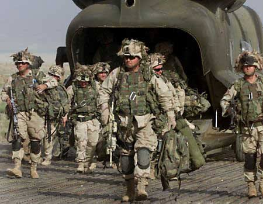

# What is CF-lang
CF-lang is an America special forces's programming language, Let's kill all the enemy!    
  
# Examples
HelloWorld:
```
ENEMY SPOTTED!
   FIRE!
   REPORTING IN "Hello World"!
   FIRE IN THE HOLE!
ENEMY DOWN!
```
  
endless loop:
```
ENEMY SPOTTED!
   FIRE!
   I AM IN POSITION A : 1!
   FOLLOW ME!
   REPORTING IN A!
   KEEP YOUR FIRE A!
       REPORTING IN "Go-to-hell!"!
   HOLD YOUR FIRE!
   FIRE IN THE HOLE!
ENEMY DOWN!
```
FizzBuzz:
```
ENEMY SPOTTED!
    FIRE!
    I AM IN POSITION A : 0!
    FOLLOW ME!
    KEEP YOUR FIRE A <= 100!
        WAIT FOR MY GO A % 3 == 0!
            REPORTING IN "Fizz"!
        GO!GO!GO!
        WAIT FOR MY GO A % 5 == 0!
            REPORTING IN "Buzz"!
        GO!GO!GO!
        MOVE ON A!
    HOLD YOUR FIRE!
    FIRE IN THE HOLE!
ENEMY DOWN!
```
  

`ENEMY SPOTTED!`: MAIN BEGIN  
`ENEMY DOWN!`:  MAIN END  
`REPORTING IN`: PRINT FUNCTION  
`FIRE IN THE HOLE`: EXIT FUNCTION  
`KEEP YOUR FIRE`: WHILE  
`HOLD YOUR FIRE`: END WHILE  
`WAIT FOR MY GO`: IF  
`GO! GO! GO!`: ENDIF  
`I AM IN POSITION [varname]:[value]`: ASSIGN  
`FOLLOW ME`: END ASSIGN  
`MOVE ON` : ++  
`MOVE BACK`: --  
`FIRE`: NOP

# How to run?
```
cd src/
python main.py [-filepath]
```

## TODOs
* Support function define
* Add `ElseIf stmt`
* Support `For Loop`
* Fix `While Stmt` bug

## Now can working:
* examples/helloworld.cf
* examples/assign.cf

## Contributing
Welcome to pull a request or open a issue!

## LICENSE
MIT LICENSE

## The Author
CF-lang was designed and developed by [Stepfen Shawn](https://github.com/StepfenShawn) in 2020.